<!-- ✦ Animated cursor banner — upload cursor-animation.svg to this same repo ✦ -->
 

 

<!-- Typing animation -->

---

*"Every line of code is a deliberate stroke, every transition a choreographed emotion."*

**© 2025 Nayan Kumar — All Rights Reserved**

*"Every line of code is a deliberate stroke, every transition a choreographed emotion."*

